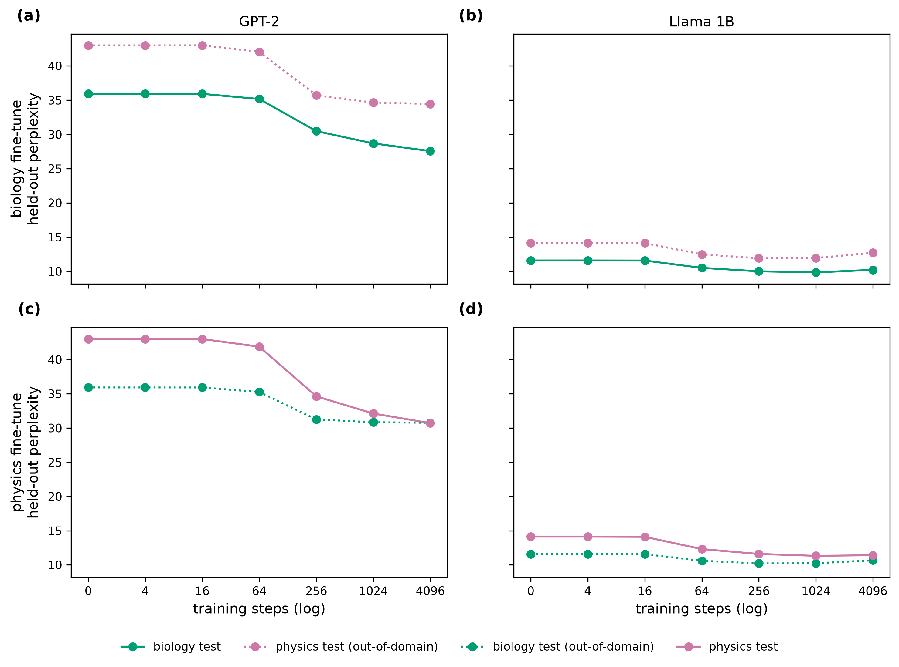

# title

## abstract

## introduction

### surprisal theory

Surprisal theory () establishes the connection between human reading time to surprisal and remains consistent across different language models.
Previous works () explore the relationship by using statistical language models (n-grams), and more recent works have explored it using modern-day large language models ().

### richer models - poorer fit

It has also been established () that while the linear relationship holds, richer parameter models provide a poorer fit to human reading times.

### domain-expertise

In this project, we continue exploring the surprisal theory, in the context of reading differences between domain-experts and novices.
[It is safe to assume] that domain experts would read texts taken from their own field of expertise faster than novices, who have not been exposed to said domain as thoroughly, if at all.

We will be using the Potsdam Textbook Corpus (Jakobi et al., 2025), that pairs eye-tracking-while-reading data with domain-labeled physics and biology university-textbook texts. The corpus contains reading data from physics and biology students, reading texts from both domains. We will be treating students reading texts in their own domain of study as "experts" and compare their gaze patterns with students of the other domain.

#### ARTICLE QUOTE

Processing difficulties due to limited lexical knowledge manifest in online measures like reading behavior. For instance, encountering individual unfamiliar or infrequent words leads to slower reading and increased revisits (Just & Carpenter, 1980; Lowell & Morris, 2014). This holds for familiarity with the vocabulary of specific domains as well. Scientific texts frequently incorporate specialized and less common vocabulary, requiring the understanding of domain-specific concepts and relations between them.

Jian and Ko (2014) report that readers with a higher level of background knowledge in physics have shorter first-pass reading times and lower regression rates and spent less time rereading in comparison to lower-knowledge readers. Additionally, encountering information that is inconsistent with the domain knowledge of the reader shows effects on neural and behavioral measures, eliciting a greater N400 amplitude (Troyer & Kutas, 2018; Troyer et al., 2020) or longer reading with more regressions (van Moort et al., 2020).

### fine-tuning

Modern LLMs have their own form of "domain-expertise", which often come in the form of domain-specific fine-tuning ().

[The cognitive motivation is clear -] fine-tuning techniques () often freeze earlier layers of LLMs, adapting only the later layers to the desired domain, similar to how we would imagine a human studying - an update of one's knowledge base without a complete overhaul of one's existing knowledge.
While we do not attempt to make the claim that the two processes are the same, [they provide motivation]

#### ARTICLE QUOTE

adapters offer a parameter-efficient method for transferring the learned features and learning the new domain. In our study, we use the so-called bottleneck adapters (Houlsby et al., 2019). During training, the layers of the pre-trained model are frozen and remain intact, while the weights of the adapters are updated with respect to the loss function on the training data. The role of the adapter weights is to provide transformations of frozen pre-trained LM given the target domain. For even larger pre-trained LM, full fine-tuning is associated with high computational costs, while adapters achieve a similar performance (Pfeiffer et al., 2020) with fewer resources.

### zero shot learning

An additional angle that we wish to explore in this study is the effects of a prior prompt on the predictive power of surprisal.
Crafted instructions, often referred to as "prompt engineering" is a standard practice in improving LLMs performance on downstream tasks, and was explored in numerous papers [large language models are zero-shot reasoners, gpt-3 paper]

!!! In modern LLMs those instructions often come in the form of persona-instructions (), yet those techniques further back. In () providing numerous examples prior to a completion task improves LLM performance as well.

As far as we're aware no attempt has been made to leverage this quality to examine the change in the predictive power of surprisal on reading time as caused by a prior prompt.

### previous work + our study

A recent study has analyzed the relation between fine-tuned language models and domain-expertise ().
In this paper, the researchers explore the effect of aligned-surprisal on a linear mixed-effects regression model fit, with respect to both text-domain-alignment (the surprisal values are taken from two models, chosen according to the text domain that is being read) and reader-domain alignment (the surprisal values are taken from two models, aligned with the readers' domain of expertise).
The researchers have found that reader-aligned surprisal provides a better fit to reading times predictions.

In this paper, we will be re-producing the main findings of (), and expanding them by asking the following questions:

- Does the predictive power of reader-aligned surprisal remain consistent under larger language models?
- What is the effect of reader-aligned zero-shot learning techniques on the predictive power of surprisal?

We approach those questions by following the paper's methodology, reproducing the main results, and replicating them on a larger language model (Llama 1B) ().
We then include prior prompts, aligned by readers' domain of expertise and examining their effects on surprisal values and the linear model's fit.

We have included a detailed comparison in the appendix comparing our methodology to aforementioned paper. [!!!]

### main findings

## data

### PoTeC dataset

#### overview

PoTeC is an eye-tracking-while-reading dataset using stimulus materials adapted from German university-level textbooks on either physics or biology.

It consists of 12 texts, 6 from each domain. It involves eye-tracking data from 75 biology (32) and physics (43) students, all of which are native German speakers.

The dataset includes the results of a reading comprehension multiple-choice exam, taken by each of the participants.
For the purpose of our study we will not be using the results of the exams, and consider a reader as an expert if the stimuli text domain aligns with their field of study.

In total, the dataset contains 142,125 data points (75 participants × (954 + 941) words). We used the PoTeC existing preprocessing scripts ([gh]) to extract reading measures. The measure we will examine in the scope of this study is total fixation time (TFT)

In addition, each stimuli text is labeled in one of three levels: common words, generally known, and domain-specific words (labeled levels 0, 1 and 2).

#### data cleaning methods

For each reader, the first and last words in every sentence are dropped from the analysis. In addition, words with TFT=0 were dropped as well.
We have aggregated the dataset per-reader, calculating each participant's mean total-fixation-time, and removed data points of TFT over 3 times the standard deviation of said participants

#### data points after cleaning

This results in a final dataset of 123,879 reader×word data points. The cleaning funnel and the final breakdown by text domain and reader expertise are:

| Cleaning stage | Data points |
| --- | --- |
| Raw (75 readers × merged reading measures) | 142,125 |
| After dropping sentence-edge words | 140,325 |
| After dropping skips (TFT = 0) | 126,382 |
| After per-reader 3·SD outlier removal | 123,879 |

| Text domain | Novice reader | Expert reader | Total |
| --- | --- | --- | --- |
| Biology | 26,717 | 34,948 | 61,665 |
| Physics | 35,707 | 26,507 | 62,214 |
| Total | 62,424 | 61,455 | 123,879 |

(The linear-model frame is a further 123,821 rows after dropping words with a missing covariate or surprisal value.)

### Fine-tuning Corpora

We used `wikipediaapi` to scrape two domain-specific datasets, and one neutral dataset.
For the initial search, we used expert-labeled terms from the PoTeC dataset. To enrich the initial list even further we used additional hand-picked seeds, consisting of course names from a standard B.Sc University curriculum from each domain (for example: Quantenmechanik, Thermodynamik for physics; Zellbiologie, Genetik for biology).
Upon visiting some term's Wikipedia page, our scraper collects all links within that article and uses them to further enrich the article pool.
We set the search depth to 2, to avoid domain drift and simplify future data cleaning tasks.
The initial scraping results consisted of approximately 6,000 articles from both domains. We then observed the pool of documents, deleted duplicates, and removed articles outside of the desired domain. In addition, math symbols and references were stripped from the text.

| Corpus | Articles | Words | Tokens (GerPT-2) |
| --- | --- | --- | --- |
| Physics | 2,800 | 2,412,209 | 3,893,179 |
| Biology | 2,431 | 1,851,069 | 3,258,685 |
| Neutral | 151 | 242,582 | 377,799 |

### model - GPT-2

The base model we used is `GerPT-2`, a German-only GPT-2 based model. (`benjamin/gerpt2`, huggingface)

- Initial (un-fine-tuned) perplexity: 35.93 on the biology test-set, 43.00 on the physics test-set.

### model - Llama

For the larger model, we used `LLaMmlein-1B` (), a German-only Llama based model.

- Initial (un-fine-tuned) perplexity: 11.58 on the biology test-set, 14.14 on the physics test-set.

## experiments and results

### fine-tuning methodology

#### LoRA fine-tuning

#### number of parameters used

The exact training hyperparameters are listed in the appendix.

### zero-shot (prompting)

Establishing a role-driven prompting methodology proved to be a challenging task;
While observing the change in surprisal for a role prompt such as "You are a Physics/Biology expert." might be a desirable research question by itself, the models we used were not trained on instruction-following or chat data (), and therefore using such prompts would have been inappropriate in the context of this study.
Using instruct-models instead would provide a new challenge: since our domain-specific scraped datasets are unstructured text, extracted from wikipedia, training on such corpora might [!!!] result in catastrophic forgetting, causing the adapted models to "forget" their instruction-following paradigm.

Therefore, we suggest the following approach: using the same training corpora, we assigned random sentences as priors to the model, and observed the change in surprisal only for the subsequent sentence.
We aligned the domain of the prior with the domain of the reader, such that a physics reader would receive a physics prior, regardless of the stimuli text.

We set the length of the prior to be a full sentence, capped at 64 tokens (roughly 3 sentences), approximately a quarter of the mean stimuli text length. The total length of the prior + the stimuli did not surpass any model's context window.

To reduce variance, we repeated the process 20 times, picking different domain-related prior prompts, and averaged the surprisal values for each prior to achieve the final surprisal value.

Since context lengths differ, the new surprisal values generated by the prompted model cannot be compared directly with the baseline model,
Previous studies () have found that longer context affects human reading-time fit negatively, with shorter context providing a better fit, we therefore expected the prompted models to provide a worse fit to the total fixation time.

To combat this confounding factor, we introduced a new pseudo-baseline, using our scraped "neutral" corpus, with no domain-specific data, we repeated the above process, only this time providing the same prior text to each reader, regardless of their domain. For this variant, the prior passages of the "neutral" corpus are unrelated to the stimuli text, essentially creating noise.
This allows us to compare the effect of a domain-aligned prompt to a neutral prompt, while keeping the context and prior length as constants.

### linear regression fit

We used the `pymer4` package to bridge between R's `lme4` package and python to fit a linear mixed-effects model to the selected reading measure, with the following features:

- word length
- word position in text
- word frequency: as estimated by dlexDB () [!!!]
- terminology: according to the PoTeC dataset
- expertise: an indicator for whether the reader's domain of studies aligns with the domain of the stimuli text
- terminology * expertise: an interaction term
- surprisal: as estimated by the language model

the fitted model is of the form:
$$Log\,TFT \sim Length + LogFreq + Position + Expertise * Terminology + (1 | SubjectID) + (1 + Expertise | WordID) \tag{2}$$

The terminology and expertise indicators were sum-coded (-1, 1)

### methodology

We start by fitting a baseline model, with no surprisal term, and then fit a second model with the surprisal term included.
We then compare the two models using a likelihood ratio test, to determine whether the surprisal term improves the model fit.

We then introduce an aligned-surprisal term, where the surprisal is estimated by a model that has been fine-tuned on the same domain as the reader's domain of expertise. Such term is calculated for each of the fine-tune checkpoints - steps of 4^n.
We then fit the linear mixed-effects model with all fine-tuned variants of the surprisal terms and the two prompt-based variants (aligned, and neutral),

[!!! Vuong is inappropriate here]

### results

#### GPT results

Each surprisal arm is compared to the no-surprisal baseline model by likelihood-ratio test (n = 123,821). ΔLL is the log-likelihood gain over the no-surprisal baseline, χ² = 2·ΔLL. Aligned checkpoints are indexed by training step.

| Arm | ΔLL | χ² | p (LRT) | AIC | β surprisal (SE) |
| --- | --- | --- | --- | --- | --- |
| Baseline | 89.99 | 179.98 | 4.9e-41 | 213105.30 | 0.0119 (0.00084) |
| Aligned (step 4) | 89.99 | 179.98 | 4.9e-41 | 213105.30 | 0.0119 (0.00084) |
| Aligned (step 16) | 90.01 | 180.03 | 4.8e-41 | 213105.25 | 0.0119 (0.00084) |
| Aligned (step 64) | 91.25 | 182.50 | 1.4e-41 | 213102.78 | 0.0121 (0.00084) |
| Aligned (step 256) | 113.74 | 227.48 | 2.1e-51 | 213057.79 | 0.0140 (0.00088) |
| Aligned (step 1024) | 122.18 | 244.37 | 4.4e-55 | 213040.91 | 0.0143 (0.00087) |
| Aligned (step 4096) | 123.15 | 246.30 | 1.7e-55 | 213038.98 | 0.0141 (0.00085) |
| Prompted (aligned prior) | 113.23 | 226.46 | 3.5e-51 | 213058.82 | 0.0138 (0.00086) |
| Prompt (neutral prior) | 111.46 | 222.91 | 2.1e-50 | 213062.37 | 0.0136 (0.00086) |

#### Llama results

| Arm | ΔLL | χ² | p (LRT) | AIC | β surprisal (SE) |
| --- | --- | --- | --- | --- | --- |
| Baseline | 76.86 | 153.73 | 2.7e-35 | 213131.55 | 0.0157 (0.00120) |
| Aligned (step 4) | 76.83 | 153.67 | 2.7e-35 | 213131.61 | 0.0157 (0.00120) |
| Aligned (step 16) | 76.80 | 153.61 | 2.8e-35 | 213131.67 | 0.0157 (0.00120) |
| Aligned (step 64) | 77.60 | 155.21 | 1.3e-35 | 213130.07 | 0.0158 (0.00120) |
| Aligned (step 256) | 78.60 | 157.20 | 4.6e-36 | 213128.08 | 0.0158 (0.00119) |
| Aligned (step 1024) | 84.67 | 169.35 | 1.0e-38 | 213115.93 | 0.0158 (0.00115) |
| Aligned (step 4096) | 76.17 | 152.35 | 5.3e-35 | 213132.93 | 0.0139 (0.00106) |
| Prompted (aligned prior) | 76.07 | 152.14 | 5.9e-35 | 213133.13 | 0.0155 (0.00119) |
| Prompt (neutral prior) | 69.40 | 138.80 | 4.9e-32 | 213146.48 | 0.0148 (0.00118) |

## discussion and conclusion

### key results

### theoretical implications

### limitations of the work

### future work

## bibliography

## appendix

- fine-tuning hyperparameters (GPT-2, Llama)
- german-commons filtering hyperparameters
